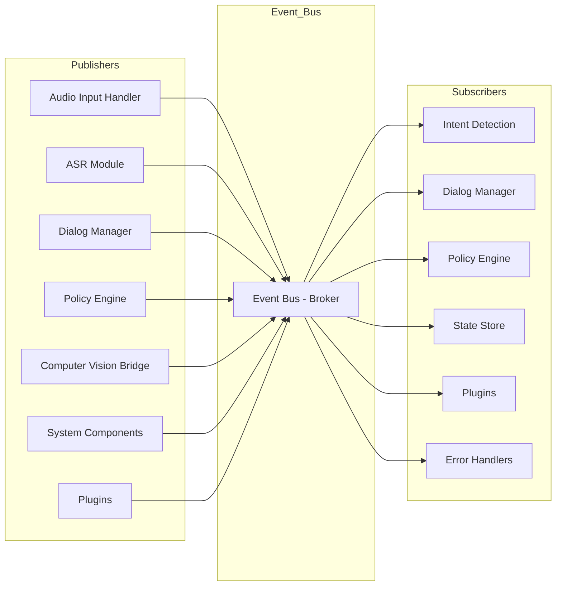

# AXIOM Pub/Sub Model

Below is a visual representation of the AXIOM event-driven architecture using Mermaid. This diagram shows the relationship between Publishers, the Event Bus (broker), and Subscribers.



**Legend:**
- **Publishers**: Components that generate events
- **Event Bus**: The broker that routes events
- **Subscribers**: Components that react to events

This model enables loose coupling, extensibility, and asynchronous processing in AXIOM.
# PUB/SUB Model for AXIOM


## Event Bus 
The event bus for AXIOM is simple, receive messages from X and send them to Y based on each `topic` 

A `topic/event` in the context of AXIOM can be defined as: 
```json
{
    "topic":"conversation.turn",
    "publishers": [
        {
            "name": "DialogManager",
            "source": "va.DialogManager",
            "description": "Publish event when user/llm create a new turn",
            "payload": { "stuff": "here" }
        }
    ],
    "subscribers": [
        {
            "name": "StateStore",
            "destination": "state.store",
            "handler": "log_convo_turn",
            "description": "Store the new turn in State",
            "payload": { "any": "return msg" }
        },
        {
            "name": "PolicyEngine",
            "destination": "policy.engine",
            "handler": "validate_turn",
            "description": "Evaluate for policy compliance",
            "payload": {}
        }
    ]
}

```

In use would look something like this for a one-way event-bus:

user: `adds to conversation`\
DialogManager: `Publishes event to event bus` \
EventBus: `Add to relevant channel` \
StateStore: `Receive event, update internal state memory`
Policy:Engine: `check compliance"


