# AXIOM System Diagrams

This document contains visual representations of AXIOM's architecture and data flows.

---

## 1. High-Level Architecture


### Architecture Components:

#### **User Interface Layer**
- **CLI**: Entry point, initializes logging and creates REPL
- **REPL**: Interactive console, handles commands and user input

#### **Virtual Assistant Layer**
- **Pipeline**: Main processing orchestrator
- **Dialog Manager**: Maintains conversation context and state
- **Intent Detector**: Identifies user intent using pattern matching
- **Response Generator**: Creates responses from templates

#### **Core Infrastructure**
- **Event Bus**: Pub/sub messaging system for decoupled communication
- **State Store**: SQLite database for persistent conversation storage
- **Policy Engine**: Evaluates and enforces policies on inputs/outputs
- **Configuration**: Centralized config management with environment overrides

#### **Utilities & Monitoring**
- **Structured Logging**: JSON logs with per-module levels
- **Error Handler**: Standardized error codes and retry logic
- **Health Checker**: System health monitoring
- **Shutdown Handler**: Graceful shutdown with timeout and retry

#### **Policy & Validation**
- **Input Validation**: SQL injection, XSS, path traversal prevention
- **Content Filter**: Banned word detection
- **Custom Policies**: Extensible policy framework

---

## 2. Event Flow Diagram


### Event Flow Phases:

#### **Phase 1: Input Validation**
1. User input received by REPL
2. Sent to Pipeline for processing
3. PolicyEngine validates input:
   - SQL injection check
   - XSS prevention
   - Path traversal detection
   - Content filtering
   - Length validation

#### **Phase 2: Intent Detection**
1. Clean input sent to IntentDetector
2. Pattern matching against configured intents
3. Returns intent type and confidence score

#### **Phase 3: Dialog Processing**
1. DialogManager processes input with intent
2. Updates conversation context
3. Publishes CONVERSATION_TURN event to EventBus
4. EventBus queues event for async processing
5. StateStore logs conversation to database

#### **Phase 4: Response Generation**
1. DialogManager requests response from ResponseGenerator
2. Template selected based on intent
3. Response generated with context variables

#### **Phase 5: Output Validation**
1. Generated response validated by PolicyEngine
2. Response length check
3. Final response returned to REPL
4. Displayed to user

---

## 3. Error Handling Flow


### Error Handling Process:

1. **Operation Execution**: Any AXIOM operation runs in try-catch
2. **Success Path**: Log with performance metrics
3. **Error Path**: 
   - Create structured AxiomError with error code
   - Log technical details to file
   - Check if error is retryable
4. **Retry Logic**:
   - Attempt 1: Wait 1 second
   - Attempt 2: Wait 2 seconds
   - Attempt 3: Wait 4 seconds
   - After 3 attempts: Log CRITICAL and fail
5. **User Communication**: Show simplified message to console

---

## 4. Health Check Flow

```mermaid
flowchart LR
    Start[Run Health Check] --> Config{Configuration<br/>Loaded?}
    
    Config -->|Yes| ConfigOK[✓ HEALTHY]
    Config -->|No| ConfigFail[✗ UNHEALTHY<br/>CRITICAL]
    
    ConfigOK --> DB{Database<br/>Connected?}
    ConfigFail --> DB
    
    DB -->|Yes| DBOK[✓ HEALTHY]
    DB -->|No| DBFail[✗ UNHEALTHY<br/>CRITICAL]
    
    DBOK --> EventBus{Event Bus<br/>Operational?}
    DBFail --> EventBus
    
    EventBus -->|Yes| BusOK[✓ HEALTHY]
    EventBus -->|Queue >80%| BusDegraded[⚠ DEGRADED]
    EventBus -->|Error| BusFail[✗ UNHEALTHY]
    
    BusOK --> Policy{Policy Engine<br/>Loaded?}
    BusDegraded --> Policy
    BusFail --> Policy
    
    Policy -->|Yes| PolicyOK[✓ HEALTHY]
    Policy -->|No policies| PolicyDegraded[⚠ DEGRADED]
    
    PolicyOK --> Disk{Disk Space<br/>Check}
    PolicyDegraded --> Disk
    
    Disk -->|> 1GB| DiskOK[✓ HEALTHY]
    Disk -->|100MB-1GB| DiskWarn[⚠ DEGRADED]
    Disk -->|< 100MB| DiskCrit[✗ UNHEALTHY]
    
    DiskOK --> Memory{Memory<br/>Usage}
    DiskWarn --> Memory
    DiskCrit --> Memory
    
    Memory -->|< 80%| MemOK[✓ HEALTHY]
    Memory -->|80-95%| MemWarn[⚠ DEGRADED]
    Memory -->|> 95%| MemCrit[✗ UNHEALTHY]
    
    MemOK --> Report[Generate Report]
    MemWarn --> Report
    MemCrit --> Report
    
    Report --> Critical{All Critical<br/>Components<br/>Healthy?}
    
    Critical -->|Yes| Healthy[Overall: HEALTHY]
    Critical -->|No| Unhealthy[Overall: UNHEALTHY]
    
    style ConfigOK fill:#50C878
    style DBOK fill:#50C878
    style BusOK fill:#50C878
    style PolicyOK fill:#50C878
    style DiskOK fill:#50C878
    style MemOK fill:#50C878
    style Healthy fill:#50C878
    
    style BusDegraded fill:#F39C12
    style PolicyDegraded fill:#F39C12
    style DiskWarn fill:#F39C12
    style MemWarn fill:#F39C12
    
    style ConfigFail fill:#E74C3C
    style DBFail fill:#E74C3C
    style BusFail fill:#E74C3C
    style DiskCrit fill:#E74C3C
    style MemCrit fill:#E74C3C
    style Unhealthy fill:#E74C3C
```



### Health Check Components:

#### **Critical Components** (Startup Blockers)
- ✓ **Configuration**: Must be fully loaded
- ✓ **Database**: Must be connected and accessible

#### **Non-Critical Components** (Warnings Only)
- **Event Bus**: Checks operational status and queue capacity
- **Policy Engine**: Verifies policies are loaded
- **Disk Space**: 
  - ✓ HEALTHY: > 1GB free
  - ⚠ DEGRADED: 100MB - 1GB
  - ✗ UNHEALTHY: < 100MB
- **Memory Usage**:
  - ✓ HEALTHY: < 80% used
  - ⚠ DEGRADED: 80-95% used
  - ✗ UNHEALTHY: > 95% used

---

## 5. Shutdown Sequence


### Shutdown Process:

1. **Signal Receipt**: SIGINT (Ctrl+C) or SIGTERM received
2. **Initiation**: 15-second timeout timer starts
3. **Request Blocking**: Stop accepting new requests
4. **Event Processing**: Complete all in-flight events
5. **Log Flushing**: Write all buffered logs to disk (2 retries)
6. **Database Cleanup**: 
   - Commit pending transactions
   - Close connections (2 retries)
7. **State Preservation**: Save conversation state
8. **Completion**:
   - Success: Clean exit within 15s
   - Timeout: Force kill after 15s with CRITICAL log

---

## Legend


**Colors:**
- 🔵 Blue: User Interface Layer
- 🟢 Green: Virtual Assistant Layer  
- 🔴 Red: Core Infrastructure (Critical)
- 🟡 Yellow: Data Storage
- 🟣 Purple: Policy & Validation
- ⚪ Gray: Utilities & Monitoring

**Line Types:**
- Solid (→): Synchronous calls
- Dashed (-.->): Asynchronous/Logging/Monitoring

---

## Usage

These diagrams are written in Mermaid syntax and will render automatically on:
- GitHub README files
- GitLab documentation
- Many Markdown viewers
- VS Code with Mermaid extension

To render locally:
```bash
# Install Mermaid CLI
npm install -g @mermaid-js/mermaid-cli

# Generate PNG
mmdc -i SYSTEM_DIAGRAMS.md -o diagrams.png
```

Or use online tools:
- https://mermaid.live/
- https://mermaid.ink/

---

## Document Updates

**Last Updated**: November 9, 2025  
**Version**: 1.0.0  
**Status**: Current with Phase 1 implementation
