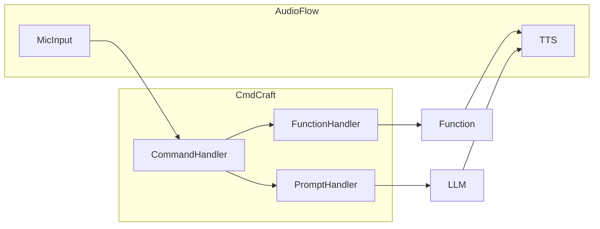

# AudioFlow

This library contains all functions that handle: 
- Microphone input 
- TTS 

Here is AudioFlow tied into the AXIOM System 

```mermaid
flowchart LR
    %% Group your modules
    subgraph CmdCraft
      CH[CommandHandler]
      FH[FunctionHandler]
      PM[PromptHandler]
      
    end

    subgraph AudioFlow
      MI[MicInput]
      TC[TTS]
    
    end

    %% Relationships
    MI --> CH
    CH --> FH
    CH --> PM
    PM --> LLM
    LLM --> TC
    FH --> Function
    Function --> TC
```

## 