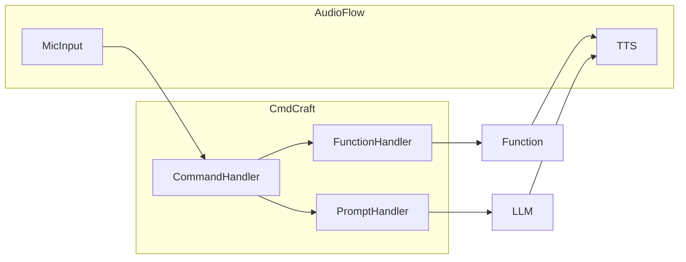

# CmdCraft

Short for Command Craft 

This Library is for:
- parsing commands 
- forming prompts for our llm 
- handling function calls

The overall structure of the library is:

# NOTES: 
- The parts work individually(Function-Handler) needs the rest of the function logic
- To get the bare minimum for the VA all we need to do right now is:
  - Implement the Rest of Function Logic
  - Implement the Pipeline for Commands/Function Calls/LLM Prompts
  - Work on AudioFlow
    - Microphone input 
    - TTS Output 
  - Implement Pipeline for Audioflow 
    - FOR NOW: `audio command` -> `CmdCraft` -> `TTS Output`
  

