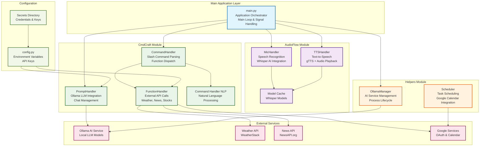

# ARA Virtual Assistant AKA The AXIOM 1.0
**Authors:** Alejandro Rubio, David Escobar  
**Company:** ZiaTechnica

---

## Overview

**AXIOM** is a Python-based virtual assistant designed to process voice or text commands, automate tasks, and integrate with external services. It is structured with modular components for speech recognition, natural language understanding, task automation, and plugin extensibility.

---

## Features

- **Voice Recognition (STT):** Captures and transcribes user speech for hands‑free interaction.
- **Text Processing (NLP/Regex):** Parses and classifies text commands into intents and parameters.
- **Text-to-Speech (TTS):** Delivers verbal responses via an offline or cloud-based engine.
- **Task Automation:** Schedules reminders and retrieves useful information.
- **Memory Management:** Remembers user preferences and context across sessions.
- **Extensibility:** Plugin-based architecture for adding new skills and integrations.

---

## Setup Instructions

### Prerequisites

- **Python ≥ 3.9** must be installed.
- Install dependencies:

  ```bash
  pip install -r requirements.txt
  ```

### File Structure

```
main.py                       # Entry point of the assistant
CmdCraft/
  ├── cmd_handler.py          # Parses input and dispatches function calls
  ├── prompt_handler.py       # Handles prompt engineering for LLMs
  └── function-handler/       # Logic for executing assistant functions
  └── helpers/
      ├── scheduler.py        # Adds events to user’s Google Calendar
      └── user_handler.py     # Manages user accounts and preferences
AudioFlow/                    # Handles TTS and microphone I/O
  └── mic_handler.py          # Records and Transcibes mic audio
  └── tts_engine.py           # Builds/generates the TTS output
```

> **Note:**  
> `user_handler.py` and `scheduler.py` are helper modules called from within `function-handler` and are **not** entry points.

---

## Functionality

### Core Components

1. **Speech-to-Text (STT)**
   - *(Done)* Captures audio input via microphone.
   - *(In-progress)* Supports offline (`SpeechRecognition`, `pyaudio`) and cloud-based STT (OpenAI Whisper, Google STT).
   - *(In-progress)* Includes text normalization (noise filtering, punctuation).

2. **Natural Language Processing (NLP / Regex)**
   - *(In-progress)* Currently using Regex for intent/parameter extraction *(to be upgraded to NLP)*.
   - Identifies commands like `get_weather`, `create_user`, `schedule`.
   - *(Planned)* Supports context tracking for follow-up queries.

3. **Text-to-Speech (TTS)**
   - Uses ElevenLabs for audio responses.
   - *(Planned)* Configurable voice parameters (speed, pitch).
   - *(Planned)* Queued responses to prevent overlap.

4. **Task Automation**
   - **Scheduler:** Create/list/cancel tasks and reminders.
   - *(Planned)* Advanced reminders: snooze, repeat.
   - *(in-progress)* External services: calendar, messaging, IoT.

5. **Memory Management** *(Planned)*
   - Store user data (name, preferences, tasks) in JSON or SQLite.
   - Auto-load on startup and save on state changes.
   - Accessible API for all modules.

---

### Architecture & Design

- **Modular Structure:** Each major component in its own file and associated library.




