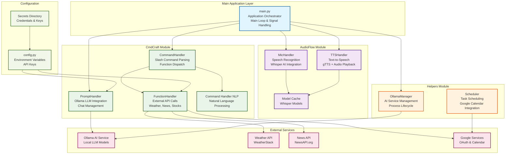

# AXIOM - Adaptive Real-time Assistant
**Authors:** Alejandro Rubio, David Escobar  
**Company:** ZiaTechnica

---

## Overview

**AXIOM** (Adaptive Real-time Assistant) is a Python-based voice-enabled AI assistant that processes voice commands, provides intelligent responses through local LLM integration, and automates various tasks. It features a modular architecture with speech recognition, text-to-speech synthesis, command processing, and external service integrations.

---

## Features

- **Voice Recognition (STT):** Captures and transcribes user speech using OpenAI Whisper for hands-free interaction
- **Text-to-Speech (TTS):** Delivers verbal responses via gTTS with multiple audio playback methods
- **Local AI Integration:** Powered by Ollama for offline LLM capabilities with local model management
- **Command Processing:** Intelligent parsing of natural language and slash commands
- **External API Integration:** Weather, news, and stock information retrieval
- **Process Management:** Robust Ollama service lifecycle management with automatic startup/shutdown
- **Cross-platform Audio:** Multiple audio playback methods (ffplay, afplay, PyAudio, file-based)
- **Performance Monitoring:** TTS performance metrics and audio capability diagnostics

---

## Setup Instructions

### Prerequisites

- **Python ≥ 3.9** must be installed
- **Ollama** must be installed and accessible (see [Ollama Installation](https://ollama.ai/))
- Install dependencies:

  ```bash
   pip install -r requirements.txt

### Environment Configuration

Create a `.env` file in the project root with the following API keys:

```
# Required for external services

# Optional configurations
WHISPER_MODEL=base
GOOGLE_OAUTH_CLIENT_SECRET=path/to/credentials.json
```

### File Structure

```
src/AXIom/
├── main.py                    # Main application entry point and orchestration
├── config.py                  # Environment configuration and API key management
├── AudioFlow/                 # Speech input/output handling
│   ├── mic_handler.py         # Microphone input and Whisper transcription
│   ├── tts_handler.py         # Text-to-speech synthesis and audio playback
│   └── model_cache/           # Local AI model storage
├── CmdCraft/                  # Command processing and AI interaction
│   ├── cmd_handler.py         # Slash command parsing and function dispatch
│   ├── prompt_handler.py      # Ollama LLM integration and chat management
│   ├── function_handler.py    # External API calls (weather, news, stocks)
│   └── cmd_handler_nlp.py     # Natural language command processing
└── helpers/                   # Utility services
    ├── ollama_manager.py      # Ollama service lifecycle management
    └── scheduler.py           # Task scheduling (Google Calendar integration)
```

---

## Functionality

### Core Components

1. **Speech-to-Text (STT)**
   - ✅ **MicHandler**: Records audio via microphone with ambient noise adjustment
   - ✅ **Whisper Integration**: Uses OpenAI Whisper for accurate offline transcription
   - ✅ **Audio Processing**: Supports WAV format with configurable timeouts

2. **Text-to-Speech (TTS)**
   - ✅ **gTTS Integration**: Cloud-based text-to-speech synthesis
   - ✅ **Multiple Playback Methods**: ffplay, afplay, PyAudio, and file-based fallback
   - ✅ **Streaming Support**: Real-time audio streaming for long responses
   - ✅ **Performance Metrics**: Synthesis timing and streaming latency tracking

3. **AI Integration (Ollama)**
   - ✅ **Local LLM**: Full offline AI capabilities with Ollama integration
   - ✅ **Service Management**: Automatic startup, shutdown, and process monitoring
   - ✅ **Model Validation**: Automatic model availability checking and fallback
   - ✅ **Chat History**: Context-aware conversations with persistent memory

4. **Command Processing**
   - ❌ **Slash Commands**: Structured commands like `/get weather for London`
   - ❌ **Natural Language**: Conversational AI responses for general queries
   - ❌ **Function Dispatch**: Automatic routing to appropriate handlers
   - ❌ **Parameter Extraction**: Intelligent parsing of command arguments

5. **External Services(*TODO*)**
   - ❌ **Weather API**: Real-time weather information via WeatherStack
   - ❌ **News API**: Current news retrieval via NewsAPI.org
   - ❌ **Stock Data**: Stock information framework (extensible)
   - ❌ **Google Services**: OAuth and Calendar integration framework

6. **System Management**
   - ✅ **Process Monitoring**: Comprehensive Ollama process detection and management
   - ✅ **Graceful Shutdown**: Signal handling and resource cleanup
   - ✅ **Error Recovery**: Automatic service restart and fallback mechanisms
   - ✅ **Performance Diagnostics**: Comprehensive system health monitoring

---

### Usage Examples

#### Voice Commands
- For now just talk, no command execution yet


#### Debug Commands
- "ollama status" - Check Ollama service status
- "tts stats" - View TTS performance metrics

---

### Architecture & Design

- **Modular Structure**: Each major component in its own module with clear interfaces
- **Service-Oriented**: Clean separation between audio, commands, AI, and utilities
- **Dependency Injection**: Main application coordinates all components
- **Fallback Mechanisms**: Multiple audio methods and error recovery
- **Process Management**: Robust service lifecycle management
- **Performance Monitoring**: Built-in metrics and diagnostics



---

## Running AXIOM

### Basic Usage
```bash
  cd src/AXIom
  python main.py
```

### Debug Mode
```bash
  python main.py --debug-ollama
```

### Signal Handling
- **Ctrl+C**: Graceful shutdown with cleanup
- **SIGTERM**: Automatic resource cleanup

---

## Development Status

### ✅ Completed Features
- Core voice recognition and TTS
- Ollama integration and management
- Command parsing and function dispatch
- External API integrations
- Process lifecycle management
- Performance monitoring and diagnostics

### 🔄 In Progress
- Basic command execution
- Enhanced error handling and recovery
- Additional external service integrations
- Performance optimizations

### 📋 Planned Features
- Plugin architecture for extensibility
- Advanced scheduling and reminders
- User preference management
- Multi-language support
- Advanced NLP capabilities
- User creation/management

---

## Troubleshooting

### Common Issues

1. **Ollama Service Not Starting**
   - Run `python main.py --debug-ollama` for diagnostics
   - Ensure Ollama is properly installed
   - Check system permissions

2. **Audio Issues**
   - Verify audio device configuration
   - Check PyAudio installation
   - Ensure system audio drivers are working

3. **API Key Errors**
   - Verify `.env` file configuration
   - Check API key validity and quotas
   - Ensure proper file permissions

### Debug Commands
- "ollama status" - Service health check
- "tts stats" - Audio performance metrics
- "audio info" - System audio capabilities

---

## Contributing

This project follows a modular architecture. When adding new features:
1. Create appropriate modules in the relevant directory
2. Follow the existing interface patterns
3. Add proper error handling and logging
4. Update this README with new functionality

---

## License

Proprietary software by ZiaTechnica. All rights reserved.


