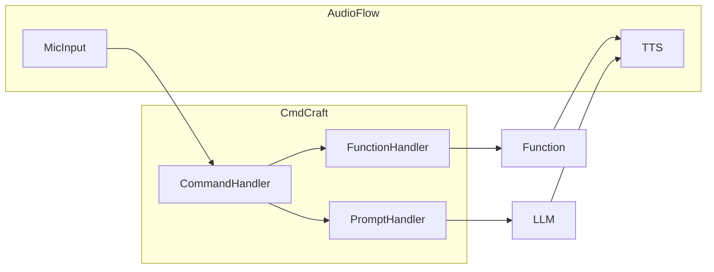
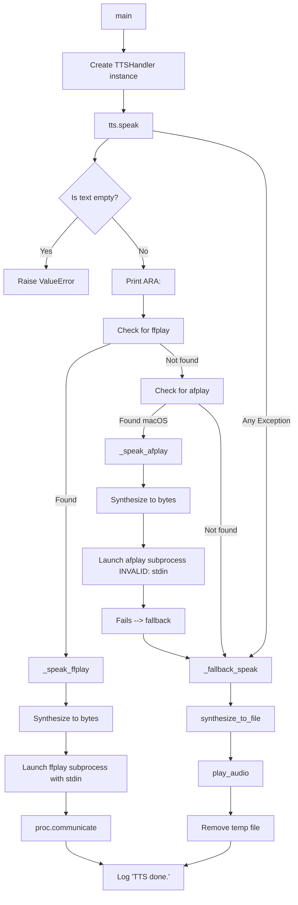

# AudioFlow
Something

This library contains all functions that handle: 
- Microphone input 
- TTS 

Here is AudioFlow tied into the AXIOM System

## The inner workings 

This was a bitch to do honestly man, I mean if you want to cut latency down? FUUUUCK 

Anyways there is the basic runndown of it: 

