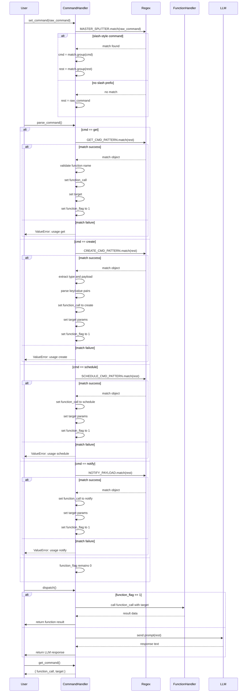

# The Command Handler

This is where all prep is done to an input command. \
For example, if you said "get weather for Austin" \
It would be parsed into:  
- `/get`  
- `weather`  
- `for`  
- `Austin`

Calling the `get_weather()` function with the `Austin` parameter.


For now there are only four types of commands:  
- `/get` &rarr; get data
- `/create`  &rarr; create data
- `/schedule`  &rarr; schedule an event 
- `/notify`  &rarr; send a message 

Notice, all commands start with `"/"`  

At the very top level this is the command structure:\
/`<cmd>` `<cmd_body>`

Where: 

- `<cmd>` : the command to be called (e.g. `get`, `create`, `schedule`, `notify`)  
- `<cmd_body>` : the parameters for the command (e.g. `<Austin>`) 

> **Data schema for all created objects**  
> ```json
> {
>  "function call": "<function_name>",
>  "target": "<additional params>"
> }

---

## /get

This is a _fetch_ command; it retrieves data from whatever source you specify.

**Syntax** \
/get `<function>` for `<target>`


- `/get` : command  
- `<function>` : the function to be called (e.g. `weather`, `news`, `stock`)  
- `for` : delimiter before parameters  
- `<target>` : target location, topic, etc.

> **Example usage**  
> ```
> /create get weather for Austin
> ```
> _Returns:_  
> ```json
> {
>   "function_call" : "get_weather()",
>   "target": "Austin"
>  }

---

## /create

Creates new user‐type objects (residents, staff, visitors, emergency services).

**Syntax** \
/create `<type>` `<params>`


- `/create` : command  
- `<type>` : one of `resident`, `staff`, `visitor`, `EmergencyServices`  
- `<params>` : attributes for the object

**Supported types & params**  
- **resident**  
  - `name`:  `<first>  <last>`  
  - `height`:  `<ft>  <in>`  
  - `weight`: `<lbs>`  
- **staff**  
  - `name`: `<first> <last>`  
  - `height`: `<ft> <in>`  
  - `weight`: `<lbs>` (_optional_)  
  - `temp`: `<true|false>` (_temporary flag_)  
- **visitor**  
  - `name`: `<first> <last>`  
  - `purpose`: `<reason for being here>`  
- **EmergencyServices**  
  - `type`: `<fire dept|police|ems>`
  - `severity`:`<critical|high|medium|low>`

> **Example usage**  
> ```
> /create resident Smith Jerry height 6 4 weight 120
> ```
> _Returns:_  
> ```json
> {
>   "function_call" : "create_user",
>   "target": {
>     "name": "Jerry Smith",
>     "type": "resident",
>       "any": {
>         "height": "6'4\"",
>         "weight": "120 lbs"
>      }
>    }
>  }
> ```

---

## /schedule

Creates an event at a specified date and time.  
_(Date parameters to be defined in future iterations.)_

**Syntax** \
/schedule <`user`> for <`event`> at <`time`>

**Example Usage**
> **Example usage**  
> ```
> /schedule jerry for Dentist at 10pm
> ```
> _Returns:_  
> ```json
> {
>   "function_call" : "schedule",
>   "target": {
>     "user": "Jerry Smith",
>     "event": "Dentist",
>     "time": "10pm"
>    }
>  }
> ```

---

## /notify

This command notifies or sends a message to a recipient 

**Syntax** \
/notify `<recipient>` `<message>`

**Example Usage**
> **Example usage**  
> ```
> /schedule notify Morty Dentist tomorrow at 10am
> ```
> _Returns:_  
> ```json
> {
>   "function_call" : "notify_user",
>   "target": {
>     "recipient": "Jerry",
>     "message":  "Dentist tomorrow at 10am"
>    }
>  }
> ```


## Sequence Diagram




Something
