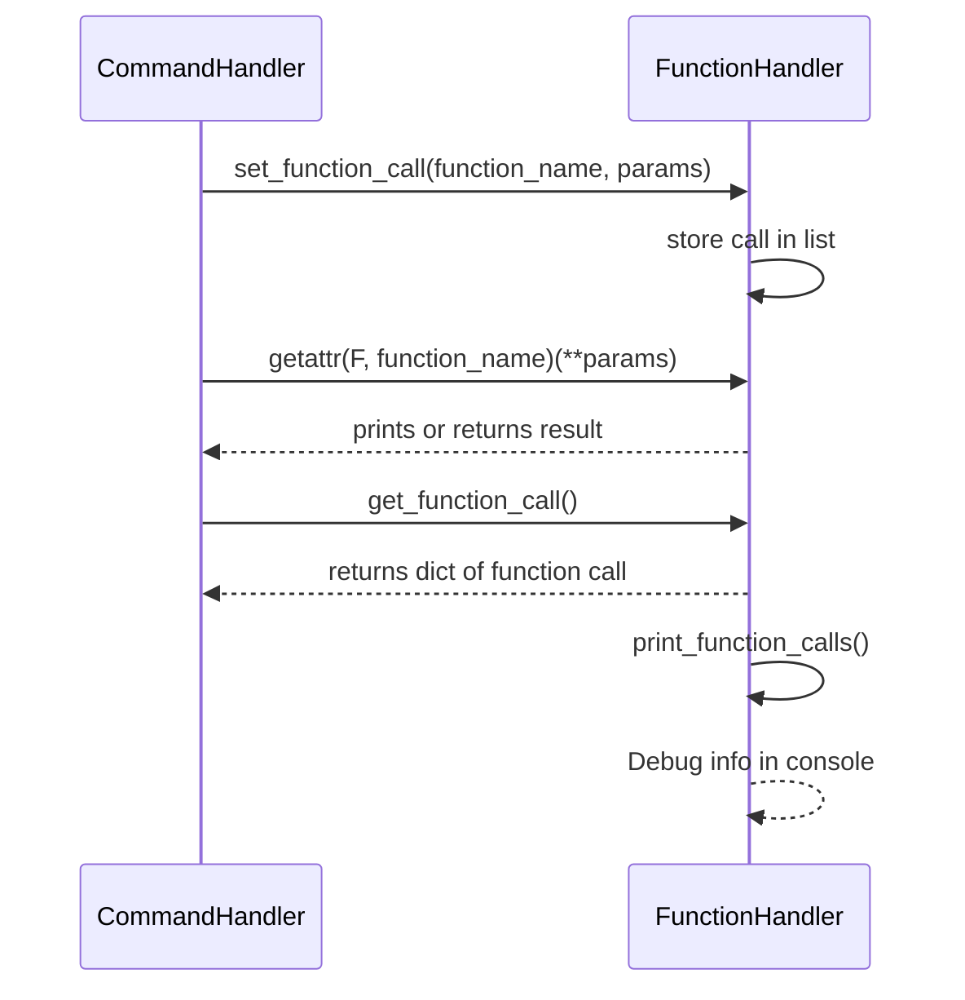

# The Function Handler

This module handles all the actual functions that are defined in the system. 
NOTE functions are NOT called here, all that happens here is function logic and calls to APIs

Used by the `Command-Handler` to execute validated calls.

For now the functions are using `kwargs`for unpacking keyword arguments

---

## Structure

The core structure consists of:
- A **FUNCTION_MAP** that links function names to their expected parameters
- A method to **set a function call**
- A method to **get the last function call**
- A print method for debugging function calls
- Implementation for each supported function

> **Function Call Schema**
> ```json
> {
>   "function_name": "<function_name>",
>   "function_params": { "key": "value", ... }
> }

---

## Supported Functions

### get_weather
Fetches current weather data using the WeatherStack API.
- **Required Param**: `location`

**Example Call:**
```python
get_weather(location="Austin")
```

---

### get_news
Stub for fetching news.
- **Required Param**: `topic`

**Example Call:**
```python
get_news(topic="Tech")
```

---

### get_stock
Stub for fetching stock data.
- **Required Param**: `stock_name`

**Example Call:**
```python
get_stock(stock_name="AAPL")
```

---

### schedule
Schedules an event for a user.
- **Required Params**: `user`, `event`, `time`

**Example Call:**
```python
schedule(user="Jerry", event="Dentist", time="10pm")
```

---

### notify
Sends a notification message.
- **Required Params**: `recipient`, `message`

**Example Call:**
```python
notify(recipient="Jerry", message="Dentist appointment")
```

---

### create_resident
Creates a resident profile.
- **Required Params**: `name`, `weight`, `height`

**Example Call:**
```python
create_resident(name="Jerry Smith", weight="120 lbs", height="6'4")
```

---

### create_staff
Creates a staff profile.
- **Required Params**: `name`, `weight`, `height`, `temp`

**Example Call:**
```python
create_staff(name="Rick Sanchez", weight="150 lbs", height="6'0", temp="true")
```

---

### create_visitor
Creates a visitor entry.
- **Required Params**: `name`, `purpose`

**Example Call:**
```python
create_visitor(name="Morty Smith", purpose="Visit Jerry")
```

---

## Execution Flow



---

## Notes
- FunctionHandler **does not** validate the command syntax — that is the Command-Handler’s job.
- All actual function logic (e.g., API calls) resides here.
- Used only after commands are parsed and validated.
#Something