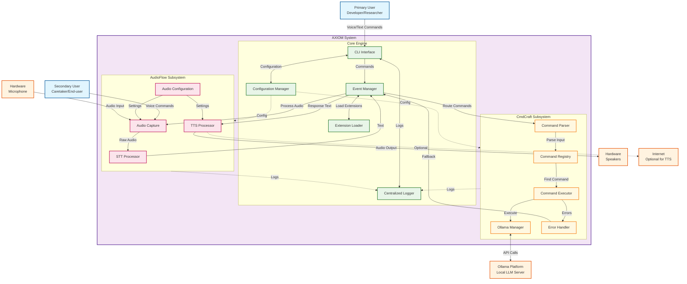

# Software Requirements Specification (SRS) for AXIOM

**Authors:** Alejandro Rubio, David Escobar  
**Company:** ZiaTechnica

---

## 1. Introduction

### 1.1 Purpose

The purpose of AXIOM (Adaptive Real-Time Assistant) is to provide a modular, locally hosted voice-enabled AI assistant capable of processing spoken and text-based commands, executing registered functions, and responding through natural language and speech synthesis. AXIOM aims to integrate with large language models (LLMs) via Ollama while maintaining local-first privacy and extensibility.

### 1.2 Scope

AXIOM will serve as a general-purpose personal assistant system with three major subsystems:

- **CmdCraft** – Handles command registration, mapping, and execution, including management of Ollama models.
- **AudioFlow** – Manages microphone input, speech-to-text (STT), and text-to-speech (TTS).
- **Core Engine** – Orchestrates input/output flow, integrates subsystems, and manages events/configuration.

The system will initially be CLI-based, with potential expansion into GUI dashboards, IoT integrations, and multimodal inputs (e.g., vision via Auralens).

### 1.3 Definitions, Acronyms, and Abbreviations

- **LLM** – Large Language Model
- **STT** – Speech-to-Text
- **TTS** – Text-to-Speech
- **Ollama** – Local LLM serving platform
- **CmdCraft** – AXIOM subsystem handling command execution and model management
- **AudioFlow** – AXIOM subsystem handling audio input/output

### 1.4 References

- IEEE 830–1998: Recommended Practice for Software Requirements Specification
- Ollama API documentation
- gTTS documentation

---

## 2. Overall Description

### 2.1 Product Perspective

AXIOM is a standalone software system composed of modular subsystems. It does not depend on cloud services and is designed to run locally. Third-party APIs (e.g., gTTS) may be used as optional plugins.

### 2.2 Product Features

- Natural language command processing (voice + text)
- Local LLM integration with Ollama
- Real-time microphone capture and transcription
- Speech synthesis for responses
- Modular command registry and execution engine
- Centralized configuration and logging
- Extensible architecture with plugin/module support

### 2.3 User Characteristics

**Primary Users:** Developers, researchers, and power users familiar with CLI environments.

**Secondary Users:** Caretakers and end-users of assistive systems (via A.R.A. integration).

Users should have basic technical literacy and willingness to configure hardware (e.g., microphone).

### 2.4 Constraints

- All processing must run locally (privacy requirement)
- Must operate on Linux/MacOS (Windows optional in future)
- Limited by Ollama-supported models (e.g., LLaMA3)

### 2.5 Assumptions and Dependencies

- User has a functioning microphone and speakers
- Ollama is installed and configured
- Python 3.10+ runtime available
- Internet connection optional (for TTS fallback)

---

## 3. System Features

### 3.1 Command Processing (CmdCraft)

**Description:**
Maintain a dynamic registry of commands/functions. Parse natural language input and dispatch to functions. Integrate with Ollama Manager for AI-driven tasks.

**Functional Requirements:**
- **FR1:** Support text and voice-based command input
- **FR2:** Execute registered functions securely
- **FR3:** Provide error handling and fallback responses
- **FR4:** Manage Ollama models (start, stop, pull, list)

### 3.2 Audio Processing (AudioFlow)

**Description:**
Handle microphone capture, speech transcription, and response synthesis.

**Functional Requirements:**
- **FR5:** Capture real-time audio from microphone
- **FR6:** Convert audio to text with < 1s latency
- **FR7:** Convert text responses to speech
- **FR8:** Allow configuration of audio device and language

### 3.3 Core Engine

**Description:**
Acts as the orchestrator for CmdCraft and AudioFlow.

**Functional Requirements:**
- **FR9:** Manage event flow between subsystems
- **FR10:** Provide centralized logging and configuration
- **FR11:** Expose CLI interface for interaction
- **FR12:** Support modular extensions

---

## 4. Non-Functional Requirements

- **Performance:** Average transcription latency < 1s, end-to-end response < 3s
- **Privacy:** All data processing must remain local unless explicitly configured
- **Reliability:** System must recover from Ollama crashes or mic disconnects
- **Security:** Command execution sandboxed; secure API endpoints if exposed
- **Usability:** Simple CLI interface with informative logs

---

## 5. Future Enhancements

- GUI dashboard for controlling commands and models
- Multi-language STT/TTS support
- IoT and smart device integration
- Vision integration via Auralens for multimodal interaction

---

## 6. Appendices

### A. System Architecture Diagram

