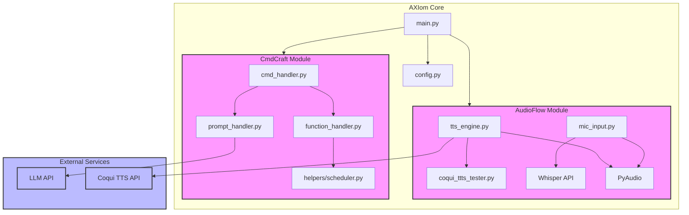

# ARA
Authors: Alejandro Rubio, David Escobar\
Company: ZiaTechnica

**NOTE ONLY UPLOAD THE MAJOR CHECKPOINTS HERE**
**Other Projects in ARA(AXIOM, ARKOS, etc) should have their own repo that keeps track of the smaller changes**

A.R.A. (Adaptive Real-Time Assistant) is an intelligent assistant designed to support caretakers \
of individuals with developmental disabilities (DD) in state group homes(residents).

Built with real-time adaptability and smart decision support in mind, ARA helps streamline daily routines, monitor behaviors(for **strong** deviations), \
and improve care through AI-driven insights.

## Features
- Real-Time Support: Responds to user input and adapts to ongoing events during care routines.

- Schedule Integration: Syncs with Google Calendar for appointment reminders, medication schedules, and task tracking.

- Behavior Tracking: Logs and analyzes patterns in behavior to support more informed caregiving.

- AI-Powered Insights: Uses machine learning to detect trends and recommend adjustments to care plans.

- Secure & Private: Designed with privacy in mind, no personal data will be sent over to the cloud for processing. All data is processed locally.

- Automated Documentation: Documents actions/behaviors/events of a resident (all in accordance with NM DOH and HIPAA)

 Tech Stack

Backend: \
 Python &rarr; Axiom/ML 

AI/ML: \
NLP &rarr; command/parameter extraction \
ComputerVision &rarr; Reading labels/detecting abnormal behaviors\
3D LiDAR &rarr; 3D mapping of environment for pose/hazard detection \

Operating System: \
C/ASM, etc

Hardware: \
I dont know yet

---

## How things are going to connect/communicate with each other

stuff

